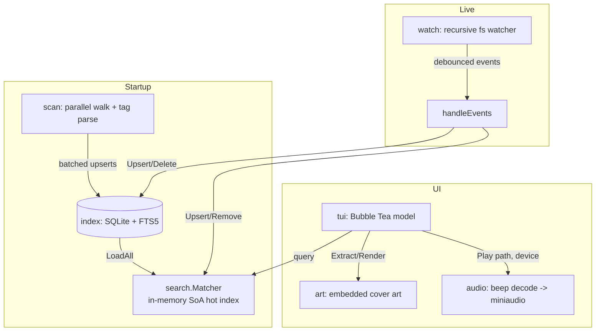

# goid3db

A blazing-fast CLI/TUI music-library indexer and player, built to stay
**interactive at 1–2 million audio files**. It maintains a permanent SQLite
index, an in-memory fzf-style fuzzy search over every ID3/metadata field, instant
incremental re-indexing via a recursive filesystem watcher, and gapless playback
to a selectable output device (default soundcard **or** a Bluetooth sink).

---

## Highlights

- **Scales to 2,000,000 tracks** while keeping per-keystroke search latency
  interactive (~100 ms worst case, ~35 ms with filters — see [Benchmarks](#benchmarks)).
- **Search everything**: title, album, artist, genre, year, folder, path and all
  raw ID3 tags, fuzzily and in parallel across CPU cores.
- **Permanent index**: a single SQLite database with an FTS5 trigram table; only
  new/changed files are re-parsed on startup.
- **Instant updates**: a native recursive filesystem watcher reflects added,
  changed and removed files into both the database and the live UI without a
  restart.
- **Device routing**: enumerate playback devices and send audio to the default
  soundcard or any connected Bluetooth speaker.
- **Album art**: embedded cover art rendered inline in the terminal.
- **Structured filters**: combine `year:`, `genre:`, `artist:` filters with free
  fuzzy text.

---

## Architecture



The performance-critical piece is `search.Matcher`. Alongside the authoritative
slice of tracks it keeps a cache-friendly **Structure-of-Arrays "hot index"**:
contiguous arrays of per-track ASCII presence bitmasks and lower-cased haystacks,
index-aligned with the tracks. Each keystroke:

1. computes an ASCII bitmask of the query,
2. rejects non-matching tracks in O(1) via the bitmask (a huge win when most of
   the corpus lacks one of the query characters),
3. runs the full fuzzy scan only on survivors, **sharded across all cores**, each
   shard bounding its output with a top-K min-heap.

This streams small contiguous memory instead of chasing pointers through millions
of large structs, which is what keeps it interactive at 2M tracks.

---

## Module layout

| Package | Responsibility |
| --- | --- |
| `main` | Flag parsing, wiring, startup indexing, watcher event handling. |
| `internal/model` | Core `Track` type, haystack + ASCII presence-mask construction. |
| `internal/scan` | Concurrent filesystem walk and audio-metadata parsing. |
| `internal/index` | Permanent SQLite index with an FTS5 trigram table. |
| `internal/search` | In-memory, sharded, fzf-style fuzzy matcher (SoA hot index). |
| `internal/watch` | Recursive filesystem watcher with debounced events. |
| `internal/audio` | Decoding (beep) and device-pinned playback (miniaudio/malgo). |
| `internal/art` | Embedded album-art extraction and terminal half-block rendering. |
| `internal/tui` | Bubble Tea terminal UI: type-to-filter list, playback, devices. |

---

## Requirements

- Go **1.25+**
- A C toolchain (`gcc`/`clang`) — `CGO_ENABLED=1` is required for the miniaudio
  audio backend.

## Install / Build

```sh
git clone https://github.com/jrsmile/goid3db
cd goid3db
go build -o goid3db .
```

## Usage

```sh
# Index the current directory and launch the TUI
./goid3db -root /path/to/music
```

### Flags

| Flag | Default | Description |
| --- | --- | --- |
| `-root` | `.` | Music library root directory to index and watch. |
| `-db` | `goid3db.sqlite` | Path to the persistent index database. |
| `-workers` | `GOMAXPROCS × 2` | Number of parallel scan workers. |
| `-no-watch` | `false` | Disable the live filesystem watcher. |

### Keybindings

| Key | Action |
| --- | --- |
| `↑` / `↓` (or `ctrl+k` / `ctrl+j`) | Move the selection |
| `enter` | Play the selected track |
| `ctrl+p` | Pause / resume |
| `ctrl+s` | Stop playback |
| `ctrl+a` | Toggle the album-art panel |
| `tab` | Cycle the output device |
| `esc` / `ctrl+c` | Quit |

Typing anything else edits the search query and re-filters instantly.

### Filter syntax

Filters can be combined with free fuzzy text (which matches every field):

| Example | Matches |
| --- | --- |
| `money` | fuzzy match across all metadata |
| `year:1994` | exact year |
| `year:1990..1999` | year range (inclusive) |
| `year:>1990` `year:>=1990` `year:<2000` `year:<=2000` | year comparisons |
| `genre:rock` | genre contains "rock" |
| `artist:"pink floyd"` | artist contains the quoted phrase |
| `artist:"pink floyd" year:1973 dark` | all filters **and** the fuzzy text `dark` |

---

## Benchmarks

Measured on an Intel i5-1335U (12 logical CPUs). "Worst case" is a query that
passes the bitmask pre-filter for most of the corpus, forcing the full fuzzy scan.

| Corpus | Fuzzy search (worst case) | Filtered search |
| --- | --- | --- |
| 1,000,000 tracks | ~99 ms | ~21 ms |
| 2,000,000 tracks | ~106 ms | ~35 ms |

Reproduce:

```sh
go test ./internal/search/ -run '^$' -bench 'Search2M|SearchFiltered2M' -benchmem
```

---

## Testing

The entire codebase is covered by unit tests at **100% statement coverage**.

```sh
# Run all tests with coverage
go test ./... -coverprofile=cover.out -covermode=set

# Show the per-function coverage report
go tool cover -func=cover.out
```

Hardware/TTY/cgo dependencies are isolated behind package-level function
variables so every error branch is exercised deterministically; database error
paths use a custom in-memory `database/sql` driver, and audio tests use a
generated WAV plus the platform playback backend.
